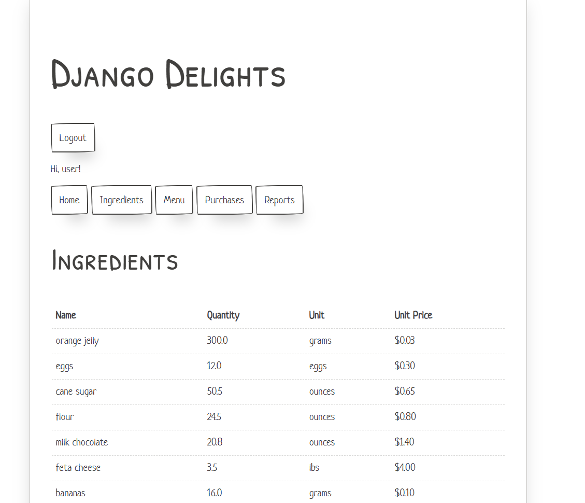
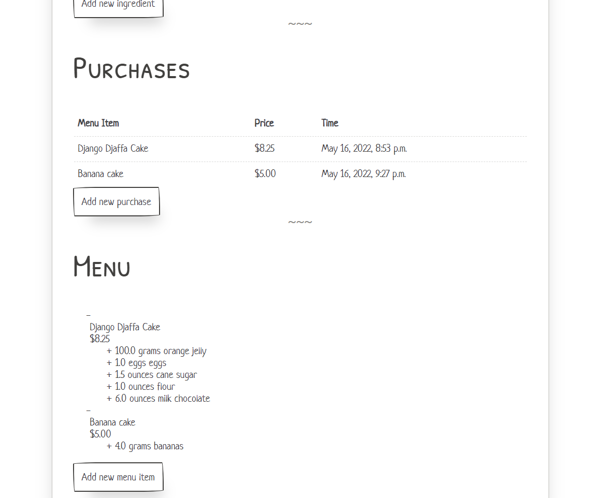
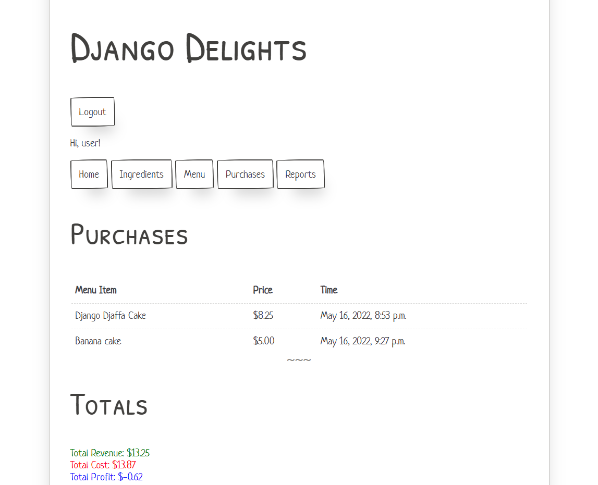

# Django Delights

A final portolio project from Codecademy: [Build Python Web Apps with Django](https://www.codecademy.com/learn/paths/build-python-web-apps-with-django) skill path.

## Prompt

Counting and aggregating data is a typical use case for Python, and Python has some powerful ways to process and generate visualizations for data. Django allows us to bring that power of Python data processing to the web, and easily store, format, and display that data using Django views. The goal of this project is to create an app to help Django Delight’s restaurant owner keep track of their inventory and sales.

## Project Requirements
Users should be able to:

-   Build an inventory and sales application using Django
-   Develop locally on your machine
-   Version control your application with Git and host the repository on GitHub
-   Use the command line to manage your application locally and test out queries
-   Users can log in, log out, and must be logged in to see the views
-   Users can create items for the menu
-   Users can add ingredients to the restaurant’s inventory and update their quantities
-   Users can add the different recipe requirements for each menu item
-   Users can record purchases of menu items (only the ones that are able to be created with what’s in the inventory!)
-   Users can view the current inventory, menu items, their ingredients, and a log of all purchases made

## Prerequisites
-   HTML
-   CSS
-   Python
-   Django
-   Git
-   Command Line

## Screenshots

  

  

  

## Setup
- Create an intial user named admin 
`python manage.py createsuperuser`

- Run the server
`python manage.py runserver`

Navigate to http://127.0.0.1:8000/ in the browser to see the server running.